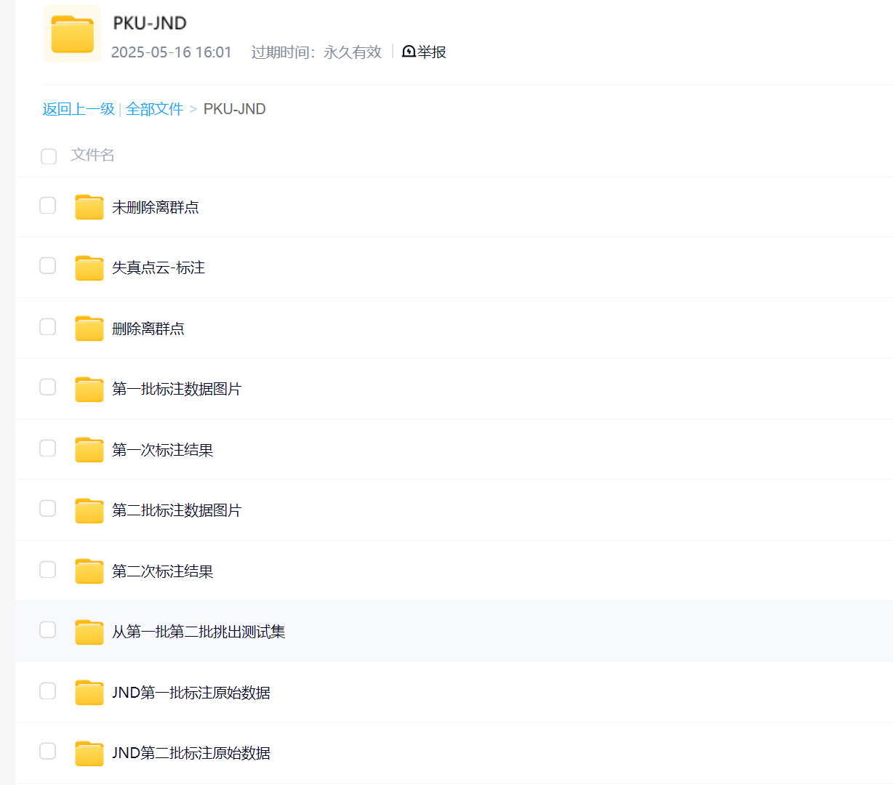
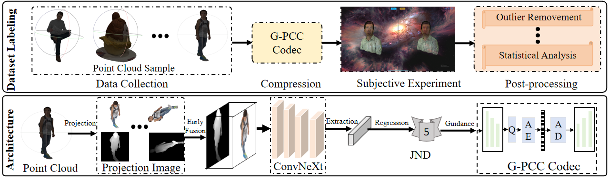
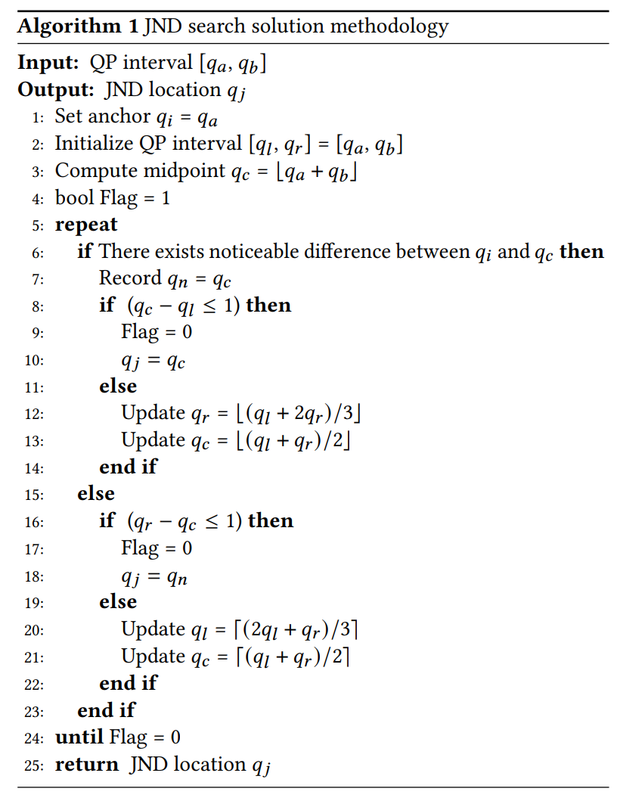
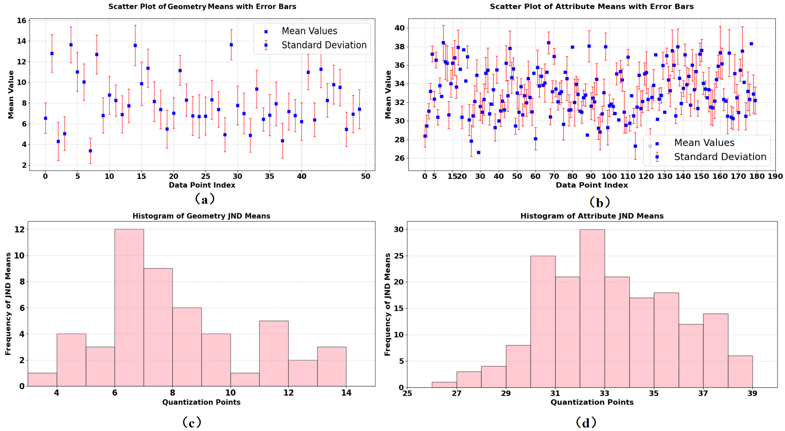
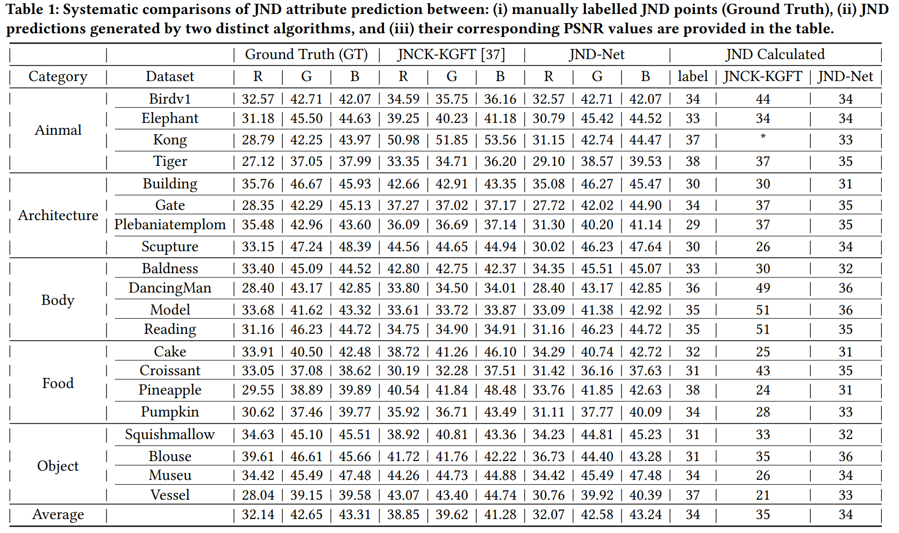

# PKU-JND: A Large-Scale JND Modeling Dataset and A Baseline for Point Cloud Compression

 

#### We appreciate any useful suggestions for improvement of this paper from peers. Please raise issues or send an email to **liangxie@stu.pku.edu.cn**. Thanks for your cooperation!

**ACMMM--25 A Large-Scale JND Modeling Dataset and A Baseline for Point Cloud Compression**

# 数据集位置（Dataset directory）
链接: https://pan.baidu.com/s/1348ZAAD7nL_5UTeQoOknrQ?pwd=8has 提取码: 8has 

数据包括：原始点云数据，几何失真数据，属性失真数据，原始点云转图片数据，标注JND点标签，去除离群点后JND点标签，测试集序列等
The dataset includes the following components: raw point cloud data, geometrically distorted data, attribute-distorted data, and image-converted data derived from the original point clouds. Additionally, it contains annotated Just-Noticeable Difference (JND) point labels, both in their original form and after outlier removal, as well as test set sequences for evaluation purposes.

 

# Motivation
As point clouds become increasingly prevalent digital representations for visualizing real-world environments for humans, Just Noticeable Distortion (JND) plays a crucial role in assessing human visual quality tolerance. Nevertheless, the absence of a high-quality JND dataset has hindered the exploration of this direction. To fill this gap, we propose PKU-JND, the first large-scale point cloud JND dataset from meticulous subjective experiments. Our dataset includes 230 pristine point cloud models of various distributions, from which we generate 5,750 geometry and 7,130 attribute distorted models. The JND threshold of each sample is labeled by $20\sim31$ participants over three months. To ensure annotation reliability, we implemented rigorous data post-processing procedures, including outlier removement and statistical analysis. Then, a novel JND modeling baseline network is proposed and exhibits strong prediction consistency with our actual human annotations. When applied to downstream compression tasks, our baseline can effectively guide compression models to achieve superior perceptual quality under low a bit rate.

# Framework

 

To address these challenges, we present PKU-JND, the first large-scale JND dataset for point cloud compression. Our dataset comprises 230 source point clouds processed with varying quantization values via Geometry-based Point Cloud Compression (G-PCC) codec, generating 5,750 geometry and 7,130 attribute distorted samples that significantly surpass conventional image or video JND datasets in scale, diversity, and experimental rigor. To ensure annotation reliability, we employ a two-phase strategy: Group 1 (31 observers) annotated 50 samples, while Group 2 (20 observers) labeled 180 samples, enabling both observer-count impact analysis and robust reliability validation. We develop specialized annotation software using a double-stimulus paradigm with multi-angle comparison capabilities, significantly improving labeling accuracy. The collected data underwent rigorous processing, including distribution analysis and a outlier detection algorithm to eliminate anomalous JND labels. The entire process of data collection, processing, and annotation took approximately four months. We design a JND prediction network (JND-Net) that can accurately determine the JND threshold for point cloud distortion. Comprehensive experiments across five test sets demonstrate PKU-JND's superior data diversity and our model's average accuracy improvement over baselines. Our main contributions include:
(1) We introduce PKU-JND, the first large-scale JND dataset for point cloud compression. It includes 230 point clouds and 12,880 compressed versions, with annotations over a three-month period.
(2) We propose a novel learning-based JND prediction network that models human visual perception of point cloud distortions. By mapping the point cloud into images and employing a convolution network to extract features for JND prediction, it achieves accurate estimation of JND point.  
(3) Extensive experiments validate both the PKU-JND dataset and our prediction network, showing strong consistency between predictions and human judgments. 

# JND Threshold Identification Algorithm

 

# JND Label Software

 

After generating point clouds with varying distortion levels, we perform JND annotations using custom-developed software that integrates annotation, quality scoring, and pre-processing functions. The annotation process employed a 27-inch 4K monitor in a Double-Stimulus Impairment Scale setup, displaying original and distorted point clouds simultaneously while allowing interactive viewpoint adjustment. Observers compared each pair and indicated perceived differences by selecting "similar" or "different". To ensure data reliability, we adopt a dual-group annotation design over three months: Group 1 (31 observers) evaluated 50 samples across geometry and attribute quantization levels 1–25 and 21–51, while Group 2 (20 observers) assessed 180 samples within the same range. This approach mitigated observer bias, enabled cross-validation of annotation consistency, and enhanced robustness for JND modeling. The dataset is partitioned into 210 training samples and 20 carefully selected test samples (two per category from each group), providing a high-quality foundation for training JND perception networks.

# Dataset Analysis   

 

# JND Prediction Result 

 